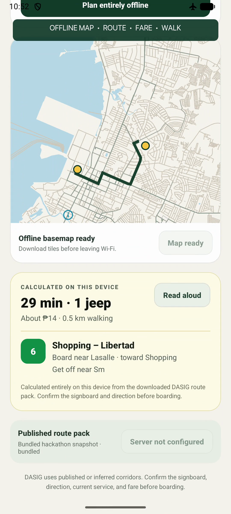

<div align="center">

# DASIG

**Offline, voice-first jeepney directions for Bacolod**

<em>Dásig</em> means "quick" in Hiligaynon.

[](https://youtube.com/shorts/7woZYkujRPg)
[](https://github.com/andrewnyu/dasig-offline-transit/releases/latest)


</div>

---

<table>
<tr>
<td width="290" valign="top">

</td>
<td valign="top">

### Goals

**📶 Work when the network doesn't.**<br>
Riders often lose data right when they need directions. Every step of trip
planning runs on the phone.

**🚌 Make jeepneys understandable.**<br>
Bacolod's routes have no timetables or official stops. DASIG tells you which
jeep to ride, where to board, which way it goes, the fare and how far you'll
walk.

**🔒 Keep it private.**<br>
Your voice and location never leave the device.

**⚡ Plan new trips, not cached ones.**<br>
Every request is calculated fresh, even in airplane mode.

</td>
</tr>
</table>

## How it works

```text
voice / text / GPS
        │
        ▼
on-device speech ──▶ landmark ──▶ DASIG route ──▶ map · fare · spoken
  recognition         matching      search          directions
```

| Step | What happens |
|---|---|
| **Listen** | Android's on-device speech recognizer. It never falls back to the cloud. |
| **Understand** | Fuzzy matching against Bacolod landmarks and nicknames, so "USLS" becomes La Salle. |
| **Route** | DASIG, a round-based search inspired by [RAPTOR](https://www.microsoft.com/en-us/research/wp-content/uploads/2012/01/raptor_alenex.pdf), adapted for jeepneys with no timetable. It turns route paths into virtual stops, plans up to three rides and weighs walking and transfers. |
| **Show** | MapLibre with a Bacolod map region downloaded ahead of time. |
| **Speak** | Android's offline text-to-speech reads the directions aloud. |

DASIG ships with **24 Bacolod jeepney routes**. An optional server publishes
verified route updates, but the app never needs it to plan a trip.

## Tech stack

| Layer | Built with |
|---|---|
| App | React Native 0.77 · TypeScript · Kotlin (native speech bridge) |
| Maps | MapLibre React Native · OpenFreeMap tiles |
| Route updates *(optional)* | Python · FastAPI |
| Data | Bacolod route plan · OpenStreetMap |

## Run it

Requires Node 18+, JDK 17+, the Android SDK and an Android 12+ device.

```bash
npm install
npm run android
```

To build a standalone APK, run `cd android && ./gradlew assembleRelease`.

> [!NOTE]
> Coverage is Bacolod only, and some routes are inferred from the city's route
> plan. Fares, times and walking distances are estimates, so confirm the
> signboard and fare before boarding.

## Learn more

- 📐 [Technical details and the DASIG algorithm](docs/TECHNICAL_DETAILS.md)
- 🎙️ [Offline voice architecture](docs/OFFLINE_VOICE_ARCHITECTURE.md)
- 🗂️ [Route data sources](docs/DATA_SOURCES.md)

<sub>Code is MIT licensed. Route and map data include OpenStreetMap data,
© OpenStreetMap contributors, under the ODbL. See [DATA_LICENSE.md](DATA_LICENSE.md).</sub>
